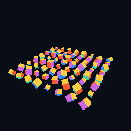

# CoreSim

**High-Performance 3D Physics Simulation Engine**

A C++20 systems and performance engineering project developed one measured milestone at a time. Current scope: **Milestone 3 — Camera and 3D Scene**. It provides a movable perspective camera and 64 independently transformed cubes, move-aware RAII GPU resources, file-based shaders, depth testing, frame timing, and tests. Entity/component storage, physics, profiling, and GPU compute are future milestones. No performance claims are made yet.



## Build and run

Requires CMake 3.25+, Git, GCC or Clang with C++20 support, and OpenGL 3.3. Linux is the primary target; macOS is also supported by the foundation. A graphical session is required to run the application.

Ubuntu/Debian dependencies:

```sh
sudo apt-get update
sudo apt-get install build-essential cmake git xorg-dev libgl1-mesa-dev
```

```sh
cmake -S . -B build -DCMAKE_BUILD_TYPE=Debug
cmake --build build --parallel
ctest --test-dir build --output-on-failure
./build/coresim
```

A grid of 64 independently rotating cubes appears. Use **WASD** to move, **Q/E** to descend/ascend, and **hold right mouse** to look. Release right mouse to restore the cursor. Escape or the close button exits. Its title updates twice per second with average FPS, delta time, and the last completed frame duration. A shutdown summary appears on standard output. Vertical synchronization is enabled; frame duration includes presentation waiting and is not a rendering benchmark.

```sh
cmake -S . -B build-release -DCMAKE_BUILD_TYPE=Release
cmake --build build-release --parallel
ctest --test-dir build-release --output-on-failure
./build-release/coresim
```

On this verified local setup, CMake is temporarily available via `export PATH="/tmp/coresim-build-tools/bin:$PATH"`. For long-term macOS use, install Xcode command-line tools and CMake normally, then use the same commands. Apple's deprecated OpenGL implementation is sufficient for this foundation. HIP is not part of this milestone.

Presets `debug`, `release`, `asan`, and `tsan` use separate directories:

```sh
cmake --preset debug
cmake --build --preset debug --parallel
ctest --preset debug
./build/debug/coresim
```

## Dependencies

CMake FetchContent downloads GLFW **3.4**, GLM **1.0.1**, and Catch2 **3.7.1**, pinned to verified immutable commits. GLFW provides window/context creation; Catch2 provides tests. GLM supplies matrix math; the generated GLAD loader is vendored with its license. OpenGL comes from the platform. Upstream dependencies retain their own licenses. No physics engine or prebuilt engine systems are used.

Initial configuration requires network access. Alternatively, use installed CMake packages with `-DCORESIM_FETCH_DEPENDENCIES=OFF` (GLFW >=3.4, GLM >=1.0, and Catch2 3), or predownloaded sources with `FETCHCONTENT_SOURCE_DIR_GLFW`, `FETCHCONTENT_SOURCE_DIR_GLM`, and `FETCHCONTENT_SOURCE_DIR_CATCH2`. Linux defaults to GLFW's X11 backend. Warnings apply only to CoreSim targets. `-DBUILD_TESTING=OFF` omits Catch2 and tests.

## Tests

Default CTest checks timing, camera/transform/scene math, and CLI handling without opening a window. The CPU tests use explicit time inputs and never sleep. GLM is required even for headless scene tests. A build without any GLFW/OpenGL dependency is available:

```sh
cmake -S . -B build-headless -DCORESIM_BUILD_APP=OFF
cmake --build build-headless --parallel
ctest --test-dir build-headless --output-on-failure
```

To run the OpenGL ownership, shader-failure, pixel/depth, and bounded window lifecycle tests:

```sh
cmake -S . -B build -DCORESIM_WINDOW_TESTS=ON
cmake --build build --parallel
ctest --test-dir build --output-on-failure
./build/coresim --frames 120
```

Linux CI uses `LIBGL_ALWAYS_SOFTWARE=1 xvfb-run -a ctest --test-dir build --output-on-failure`, with `xvfb` installed. GitHub Actions covers GCC/Clang Debug/Release and headless sanitizers; its remote results must be checked after a push.

```sh
cmake --preset asan -DCORESIM_BUILD_APP=OFF
cmake --build --preset asan --parallel
ctest --preset asan
```

`CORESIM_SANITIZER=address` enables ASan plus UBSan; `thread` enables TSan separately on supported hosts; `none` is the default. These instrument CoreSim targets, not third-party code. TSan is provided for later concurrency work; this milestone is single-threaded.

## Architecture

- `Application` owns `GlfwRuntime`, `Window`, `Renderer`, camera, and scene. Reverse destruction releases GPU resources before the context and runtime.
- `Window` handles native events, context setup, framebuffer size, and presentation. OpenGL rendering lives in `coresim_renderer`.
- `VertexBuffer`, `IndexBuffer`, `VertexArray`, and `Shader` are noncopyable, movable RAII owners. Shader compilation/link failures include file paths and driver diagnostics.
- `Renderer` receives view-projection and a read-only transform span; it shares one cube mesh across 64 draws. Camera and scene state remain outside the renderer.
- `FrameTimer` uses a steady clock. Delta is start-to-start; frame duration covers event processing through buffer swap. FPS averages completed frames over elapsed runtime.

See [camera/scene design and controls](docs/scene.md) and [renderer design](docs/renderer.md) for ownership contracts, the draw pipeline, shader paths, and testing rationale. Format C++ files with the checked-in `.clang-format` configuration.

Shaders are copied into the build directory and found independently of the working directory. Rebuild and restart after changing them. For a relocated executable or custom shaders:

```sh
./build/coresim --shader-dir /absolute/path/to/shaders
```

See [verification notes](docs/verification.md) for actual local results and commands. The screenshot above is an actual framebuffer capture, not an illustration or performance benchmark.

**Next: Milestone 4 — Entity/Component Foundation**, only on explicit request: stable IDs, safe entity lifecycle, and simple contiguous component storage.
