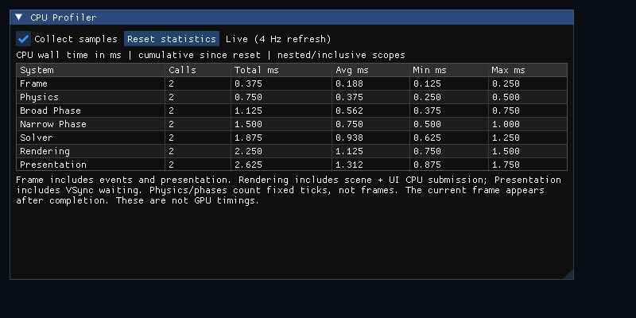

# Built-in CPU profiler

Milestone 9 adds a Dear ImGui panel to the interactive application. The table refreshes four times per second and shows invocation count, total, average, minimum, and maximum duration in milliseconds since startup or the last reset. Collapse or resize the window using the usual ImGui controls. **Collect samples** pauses/resumes timing without pausing the simulation. **Reset statistics** clears all rows while preserving the collection state; it does not reset physics. The UI captures mouse/keyboard input before camera movement or R-reset handling. Escape still closes the application.



This actual framebuffer capture uses deterministic test samples to verify layout; the displayed numbers are not performance measurements.

## Timing boundaries

| Section | One invocation | Includes |
| --- | --- | --- |
| Frame | One frame-loop iteration | Event handling, ImGui frame setup, updates, rendering, and presentation; an OS close during event processing can record an abbreviated final iteration |
| Physics | One fixed tick | Integration, collision detection and response; excludes the scene's optional visual spin update |
| Broad Phase | One collision solve | Spatial-hash build + queries, duplicate removal, sorting, pair-batch fill |
| Narrow Phase | One collision solve | Eligibility checks, primitive detection, constraint creation across all batches |
| Solver | One collision solve | Velocity impulses and positional correction, including contact rechecks |
| Rendering | One rendered frame | Scene draw calls, profiler window construction, and ImGui draw submission; excludes backend frame setup and buffer swap |
| Presentation | One frame | Buffer swap and any VSync/driver waiting |

Timings are inclusive CPU wall durations from `steady_clock`. Nested rows must not be added together. Physics can run zero or multiple times per display frame; an empty phase still records an invocation. The frame/rendering rows include completed scopes, so the frame currently drawing the table appears on a later refresh. Millisecond output to three decimals is formatting precision, not clock accuracy. GPU work is asynchronous; rendering measures CPU submission and possible driver stalls, not GPU execution. Presentation often dominates a VSync-limited run. First-use font/shader initialization can appear in maximum frame times; reset after warmup when investigating steady-state behavior.

## Instrumentation and ownership

```cpp
coresim::Profiler profiler;
{
    coresim::ScopedProfiler timer(&profiler, coresim::ProfileSection::rendering);
    // Work to measure; scope exit records the duration, including on exception unwind.
}
```

The profiler uses a fixed enum-indexed array, with no allocation, name lookup, string creation, or locking when recording samples. RAII scopes read the clock on entry/exit only when collection is enabled. Null/paused scopes avoid clock calls. This main-thread design is intentionally not thread-safe; worker aggregation belongs to later threading work. The owning profiler must outlive its scopes. An optional injectable clock supports deterministic tests and must not throw.

Physics accepts an optional profiler pointer. It reuses the existing collision phase counters/timers and records one aggregate sample per phase per tick, rather than issuing a profiler update per pair. If both benchmark stats and a profiler are supplied, they share the same measurements. Headless benchmarks pass no profiler and retain their existing timing behavior. Pausing collection also disables collision timing in the interactive application. Invalid/negative/nonfinite samples are ignored, and count/total overflow is guarded. Empty rows report zero average/min/max. Reset or enable-state changes invalidate active scopes so they cannot publish a partial pre-reset or pre-pause duration afterward.

`ProfilerPanel` owns its ImGui context, GLFW callbacks, and OpenGL backend resources. It is destroyed before the window/context. GLFW input remains on the main thread. The OpenGL backend restores render state. ImGui settings/log files are disabled, so runs create no `imgui.ini` artifacts. The interactive shutdown summary prints the final profiler rows for diagnostic capture.

Dear ImGui **v1.91.9b** is pinned to `f5befd2d29e66809cd1110a152e375a7f1981f06` with its official GLFW/OpenGL3 backends and embedded GL loader. Its MIT license remains in the fetched source's `LICENSE.txt`. It is fetched/built only when `CORESIM_BUILD_APP=ON`; headless physics and benchmark builds require neither ImGui nor GLFW/OpenGL. With dependency fetching disabled, provide `-DCORESIM_IMGUI_SOURCE_DIR=/path/to/imgui` containing that version and its backends, alongside the installed GLFW/GLM/Catch2 packages. A predownloaded source override for normal fetching is `-DFETCHCONTENT_SOURCE_DIR_IMGUI=/path/to/imgui`.

## Verification

Deterministic CPU tests cover aggregation, zero/invalid samples, nested scopes, exception unwinding, reset, pause/resume, disabled clock-read avoidance, and unchanged physics results. Display tests render the actual table to an explicit framebuffer, check visible content and GL errors, exercise pause/resume/reset with ImGui input events, and recreate/destroy the UI context. The existing renderer and window smoke tests run alongside them. No timing-performance thresholds are asserted in unit tests.
